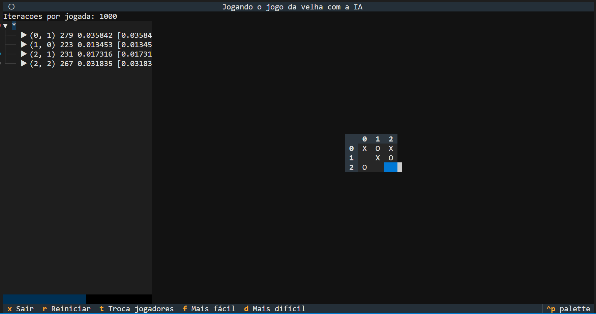

# MCTS no textual

Parte da [palestra que eu dei na Twitch no dia 25 de maio de 2025](https://www.youtube.com/watch?v=zj_ALNomkWE).

## Como executar?

1. Faça um clone do repositório.
2. Rode `poetry install`.
3. Rode `poetry run mcts`.



## Ferramentas de desenvolvimento

### DevContainer

Esse projeto possui o [DevContainer](https://containers.dev/) configurado para a criação automática do ambiente de desenvolvimento dentro de um contêiner. Desta forma não é necessário a instalação de nenhuma ferramenta específica no computador, além do editor e do [Docker](https://www.docker.com/). E quando não quiser mais, basta remover o contêiner e imagem.

Para utilizá-lo no [VS Code](https://code.visualstudio.com/) é ncessário instalar o plugin [Dev Containers](https://marketplace.visualstudio.com/items?itemName=ms-vscode-remote.remote-containers). Após sua instalação, quando este projeto for aberto, o VS Code perguntará se deseja reabri-lo dentro do contêiner, ao confirmar uma imagem com as ferramentas necessárias será criada, e toda configuração será feita automaticamente, deixando o ambiente pronto para executar o projeto e desenvolvê-lo.

### Lints

Para executar os lints do projeto, execute o comando:

```sh
poetry run task lint
```

Para corrigir os problemas de formatação, execute o comando:

```sh
poetry run task fmt
```

Para corrigir automaticamente os casos de lint possíveis, execute o comando:

```sh
poetry run task lint-fix
```
